# HackFight 🇨🇭  

Swiss gamedev and VR fan  
More about me on [HackFight.dev](https://www.hackfight.dev)

I speak french and english.

Feel free to get in touch on discord: [@HackFight](https://discordapp.com/users/691967643728609290)

**Owner of:**

  
  

## Stats

## Examples of my work

  
  
  

